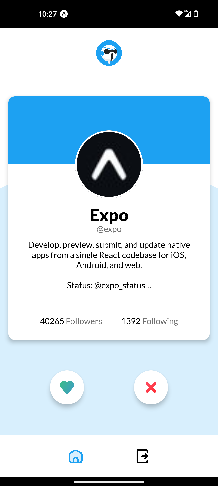

<h1 align="center">
  
   
  Stormtwoopers
</h1>

Stormtwoopers is a mobile app that allows you to easily sort your Twitter subscriptions by swiping right or left.

  

## Installation

### Requirements

- [Node.js](https://nodejs.org/en/)
- [Expo](https://expo.io/)
- [Twitter Developer Account](https://developer.twitter.com/en/apply-for-access)
- [Expo Account](https://expo.io/signup)

### Setup

1. Clone the repository
2. Install dependencies with `npm install`
3. Create a Twitter Developer Account and create a new app (see [below](#setting-up-the-twitter-developer-account) for more details)
4. Create a `/src/shared/config.ts` and fill it (see [`/src/shared/config.ts.example`](src/shared/config.ts.example) for an example)
5. Remove the `owner` field from the `app.config.js` file

<!-- **Expo Project**

You will need to create a new Expo project named "Stormtwoopers". You can go to [https://expo.dev/accounts/<username>/projects?create=true](https://expo.dev/accounts/<username>/projects?create=true) to create a new project. Once you have created the project, you will need to link the project to the repository. You first need to remove the `owner` field from the `app.config.js` file. Then, you can run `expo init --id <project-id>` (the command will be displayed on the project page) to link the project to the repository. -->

#### Setting up the Twitter Developer Account

Once you have created a Twitter Developer Account, you will need to create a new app named "Stormtwoopers".

> Note: The app should have access to the Twitter API v2.

Once you have created the app, you will need to configure the app to allow for user authentication. Here are the fields you will need to fill out:

| Field | Value |
| --- | --- |
| App permissions | Read and write |
| Request email from users | Yes |
| Type of app | Native App |
| Callback URI / Redirect URI | `https://auth.expo.io/@<your-username>/stormtwoopers` |
| Website URL | `https://github.com/arthur-fontaine/stormtwoopers` |
| Terms of service | `https://github.com/arthur-fontaine/stormtwoopers/blob/main/TERMS_OF_SERVICE.md` |
| Privacy policy | `https://github.com/arthur-fontaine/stormtwoopers/blob/main/PRIVACY_POLICY.md` |

## Usage

<!-- | Platform | QR | URL |
| --- | --- | --- |
| Android |  | [exp://u.expo.dev/update/1b5f2b96-fb44-442f-908f-da8b14bfd515](exp://u.expo.dev/update/1b5f2b96-fb44-442f-908f-da8b14bfd515) |
| iOS |  | [exp://u.expo.dev/update/7b758f29-0845-4f3f-9244-7cfc7a51e2a1](exp://u.expo.dev/update/7b758f29-0845-4f3f-9244-7cfc7a51e2a1) | -->

### Development

1. Run `npm start` to start the development server
2. Scan the QR code with the Expo Go app on your mobile device ([iOS](https://apps.apple.com/us/app/expo-go/id982107779) or [Android](https://play.google.com/store/apps/details?id=host.exp.exponent&hl=en_US&gl=US))

## Contributing

Contributions are welcome! Open an issue, submit a pull request, or reach out to me on [Twitter](https://twitter.com/f_arthr).

## License

[MIT](LICENSE)
